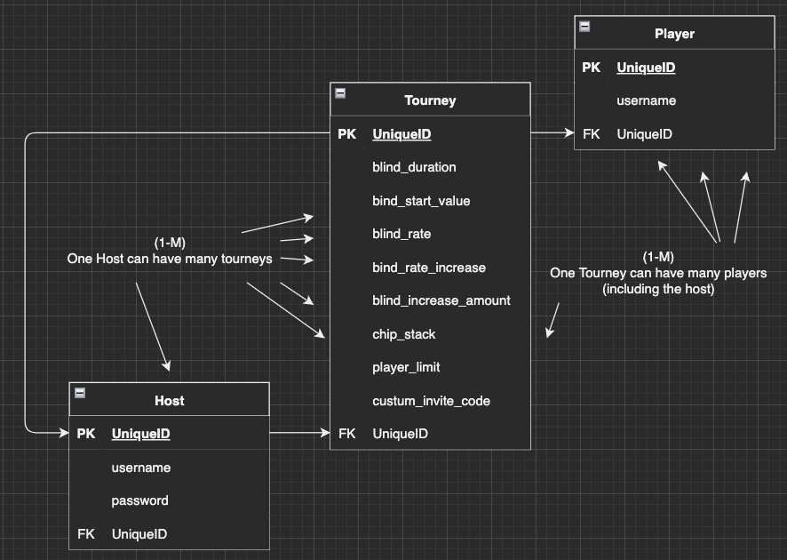
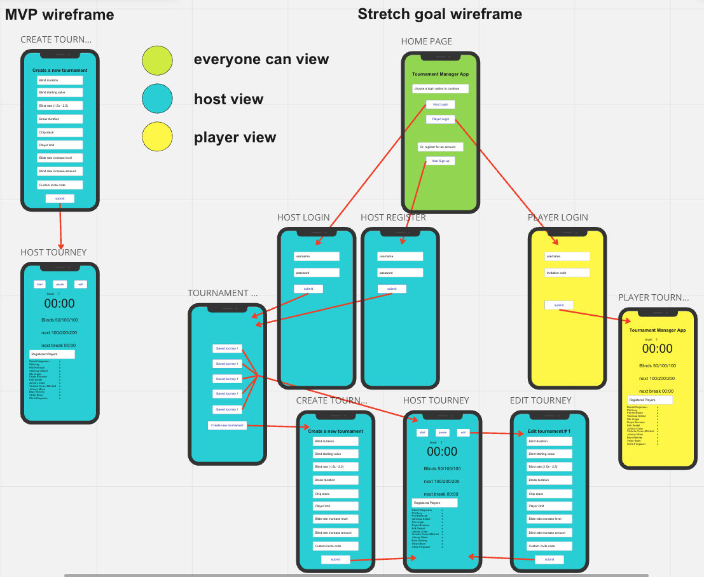

# tournament_manager

### Deployed app

ADD LINK TO APP

## app description
This is an app for managing a poker tournament. The user will be anyone who hosts a poker game, from small "kitchen table" home games to large multi-table tournaments. The app will display all the information a player needs to see during a game, while the host will be able to create tournament templates and adjust all the settings for each game type they want to play.

## Installation instructions

ADD INSTALLATION INSTRUCTIONS

## tech stack

The foundation of this app will be built in javaScript and React. I plan to research and learn how to use Flutter to create a mobile app. For the backend I plan to use mongoose and mongoDb to manage the database.

After much consideration, I have decided to divert course, and attempt to build this app with React Native. Any further tech stack developments will be recorded as they arise.

## user flow
The user will be both the host and the player of a poker game. The flow will be different depending on the account type. Any user not logged in will be directed to the home page, which displays two buttons: Host, and Player.
__The Host__: By clicking the "Host" button, a login page will load, with an input for a username and password, as well as a "Register" button that takes the user to the registration page. By completing either the login or the registration form, the user is taken to their "Tournament Home" page.
The Tournament Home page is where the host will see the Tournaments they have saved as well as a "New Tournament" button. Clicking the "New Tournament" button the user will be taken to the page that renders the new tournament form. This is where the user will create a new tournament to save to their profile. Once a tournament is saved the user is redirected to the Tournament home page. If the host selects one of the saved Tournaments they will be taken to the "Tourney" page.
On the "Tourney" page the Host will see all the tournament's information, the clock will be set to the default time, and any registered players will be listed. There will be an invite link the Host can copy and send to players they want to invite. Only the Host will able to see and click the start, pause, and restart buttons. Next to each players name, the host will see a button next to each player to eliminate them from the tournament when they have run out of chips. Lastly, the host will see a button allowing them to register for the tournament.
__The Player__: By clicking the "Player" button, a login page will load, with an input for a username and password, as well as a "Register Player" button that takes the player to a page that renders a player registration form. When the player logs in or registers an account they are directed to a join Tournament page, that shows an input field for them to enter the invite information to get them into the host's game.
When a player has logged in and provided valid invite information they are directed to the player side of the "Tourney" page. On the "Tourney" page the user can see most of the same information the host can see but none of the ability to edit or change anything. When a player has been eliminated by the host, they will see a message telling them they have been eliminated and when the game is over it will display the Winner until the page is closed or reloaded.

## User stories

* As as user I want to be able to manage my poker tournament from one website or app.
* I would like to be able to adjust the settings for each game.
* Players should be able to sign in and view the game on their own devices.

## Daily sprints

* __Tuesday Oct-25-2022:__
    * set up the repo to be a react app
    * connect the user auth login and registration
    * research flutter
    * build the front end routes

    __notes:__

     * Tuesday was much less productive than expected. Research into Flutter revealed that it uses the Dart language. After a quick review I have decided this will take too much time to accomplish before the deadline on Monday. Brief research into Qi QML looks promising at first, but doesn't pan out due to use of the QML language and overall obscurity. Oddly, I decide to follow the original plan and take on the task of learning React Native in the hopes that my "native" language javaScript will help me overcome the challenges and roadblocks. Halfway through a tutorial for a react native todo list project, I can't get past a bug giving me a red screen on my phone and a white screen on my browser. I know it's one of hte dependency modules, but at 11:30 pm I call it a day.

* __Wednesday Oct-26-2022:__

    * Study, and practice using React Native
    * complete to-do tutorial

     * _EDIT_ * the planning stage and learning stage are going to continue through most of the day. Refactored the daily outline to reflect a more achievable daily sprint. 

    __notes:__

     * Lucas helped me debug and find the dependency that wasn't installed correctly and we were able to render "Welcome Home" through the Expo app on my phone.
     * I worked through the bugs on the to-do tutorial for the rest of class time. After which I took the night off a went and played a poker game. And won. While at the table I read the entire react native documentation and watched the beginning of a YouTube tutorial that seems promising.

* __Thursday Oct-27-2022:__

    * connect the repo to the virtual iOS with "Hello World"
    * build timer functionality
    * set-up the default game format

* __Friday Oct-28-2022:__

    * finish default format
    * test default game for bugs and edge cases
    * create the new game form

* __Saturday Oct-29-2022:__

    * finish game form
    * render new game form as home page
    * connect the new form/home page to the Tourney page

* __Sunday Oct-30-2022:__

    * styling
    * plan and practice presentation

* __After Cohort:__

    * After the cohort is complete I plan to continue until I achieve every stage of stretch goals. Beyond that there is a lot more functionality that could be added. I plan to explore this project until I am satisfied.

## MVP Goals

* Learn the basics enough to begin a working knowledge of React Native.
* Complete tutorial on building a to-do list with React Native.
* Achieve a deployed app with a minimum "Hello World" statement rendered.

## 1st Stage Stretch Goal

* Build basic tournament format and functionality with default game settings:
    * 15 minute levels (blind_duration)
    * 50/100 blinds 2x (blind_start_value, blind_rate)
    * 15 minute break every hour (break_duration)
    * no player limit (player_limit)
    * no blind increase (blind_rate_increase, blind_increase_amount)
* Render this screen as the home page.

## 2nd Stage Stretch Goal

* Render a form as the new home page.
    * The form will allow the user to adjust the default settings.
    * Submit button that takes the user to the home page.

## 3rd Stage Stretch Goal

* Let a "Host" register for an account.
    * Save tourneys to profile.

## 4th Stage Stretch Goal

* Add the ability to display the tourney on multiple devices at the same time.
    * This must be an accurate game time for the blind levels on all subsequent screens.

## 5th Stage Stretch Goal

* Add player accounts.
    * Allow players to sign in with an invite code to view the game details on their own phones.

## Pages

* Home page: where the user selects Player or Host.
* Host login page: where the host enters username and password.
* Player login page: where the player enters username, and invite code.
* Host registration page: where the host registers for a profile.
* Tournament home page: where the host picks a game to run, or navigates to the edit tourney page.
* New tourney page: where the host will create a new tournament format.
* The tourney page: where the host controls the tournament and the players can view the game clock and details.

## RESTful routing chart

| **Action** | **Route** | **Description** |
|--------|-------|-------------|
| GET    | / | show the home page |
| GET    | /hosts | show the host login page |
| POST   | /hosts/login | login the host |
| GET    | /players | show the player login page |
| POST   | /players/login | login the player |
| GET    | /hosts/register | show the host registration page |
| GET    | /tourneys/home  | show the tournament home page |
| GET    | /tourneys/create  | show the create tourney page |
| POST   | /tourneys/:id | create a new tournament |
| PUT    | /tourneys/:id    | edit an existing tournament |
| DELETE | /tourneys/:id  | delete an existing tournament |
| GET    | /tourneys/:id | show tournament page |

## ERD chart

## Wire-frames

[miro-board] (https://miro.com/app/board/uXjVPJi2k4A=/?share_link_id=469659624669)

## Approach taken

ADD APPROACH TAKEN

## Post project reflection

ADD POST PROJECT REFLECTION